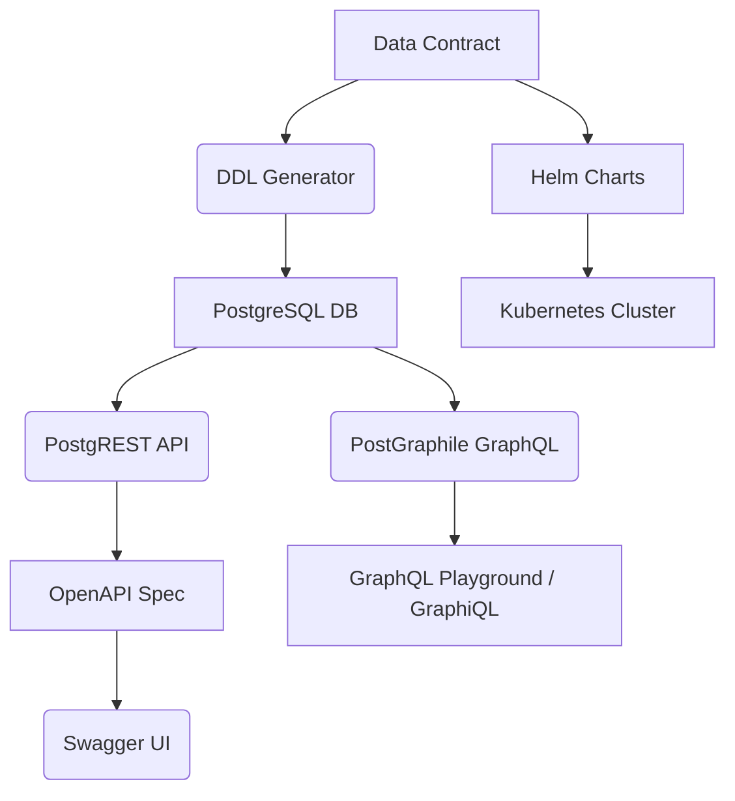
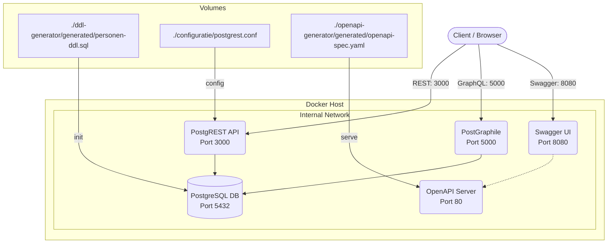

# ODCS Architecture Overview

## High-Level Overview
The ODCS project follows a **contract-first** architecture where the data contract (`datacontract/personen.yaml`) serves as the single source of truth. This drives automated generation of:
- Database schema (SQL/DDL)
- OpenAPI API specification
- ER diagrams and documentation
- Kubernetes Helm charts

## Core Components
1. **Data Contract (YAML)**
   - Defines data structures, metadata, and SLA requirements
   - Serves as input for all automated generation processes

2. **Database Layer (PostgreSQL)
   - Stores personen/adres data
   - Auto-generated DDL from the contract
   - Includes indexes for performance optimization

3. **API Layer (PostgREST / GraphQL options)**
   - Exposes data via a RESTful API (PostgREST) and a GraphQL interface (PostGraphile)
   - *PostgREST:* Follows an "Auto-REST" pattern; exposes OpenAPI and supports resource embedding (e.g., `?select=*,related(*)`)
   - *PostGraphile:* Provides a flexible GraphQL interface derived from the database schema

4. **Documentation (Swagger UI)
   - Visualizes the generated OpenAPI spec
   - Provides interactive API testing capabilities
   - Includes ER diagrams for data structure visualization

5. **Deployment Stack**
   - Docker Compose for local development
   - Kubernetes Helm charts for production deployment
   - Ingress controllers for external access

6. **Validation & Testing**
   - **JMeter:** Performance and functional testing for both REST and GraphQL interfaces.
   - Test plans are located in the `tests/` directory.

## Data Flow
1. The YAML contract is processed by the `ddl-generator` to create SQL DDL
2. PostgREST converteert de PostgreSQL-database naar een REST API volgens het **Auto-REST**-patroon. Dit betekent dat endpoints en relaties automatisch worden afgeleid van het databaseschema.
   - Voorbeeld: `GET /adressen?select=*,personen(*)` haalt adressen en hun gerelateerde persoon-records op in één aanroep.
3. PostGraphile ontsluit de database via een **GraphQL** interface. Net als PostgREST worden de queries en mutaties automatisch gegenereerd op basis van de tabellen en relaties in de database.
   - Voorbeeld: Een GraphQL query kan diepe geneste relaties opvragen zonder extra configuratie.
4. OpenAPI spec wordt gegenereerd voor documentatie en testen
5. Swagger UI renders the OpenAPI spec into an interactive interface
6. Helm charts package the entire stack for Kubernetes deployment

## Diagrams
### High-Level Flow

### Deployment View (Docker)
