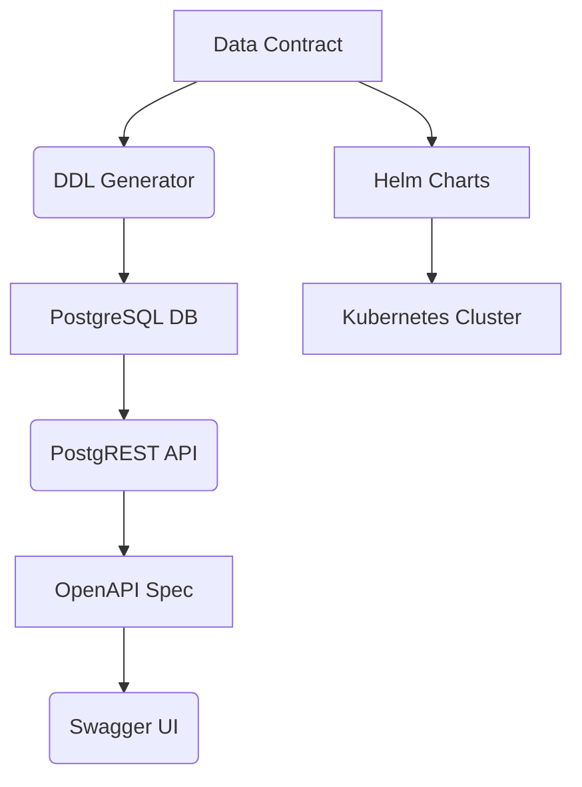

# ODCS Architecture Overview

## High-Level Overview
The ODCS project follows a **contract-first** architecture where the data contract (`datacontract/personen.yaml`) serves as the single source of truth. This drives automated generation of:
- Database schema (SQL/DDL)
- OpenAPI API specification
- ER diagrams and documentation
- Kubernetes Helm charts

## Core Components
1. **Data Contract (YAML)**
   - Defines data structures, metadata, and SLA requirements
   - Serves as input for all automated generation processes

2. **Database Layer (PostgreSQL)
   - Stores personen/adres data
   - Auto-generated DDL from the contract
   - Includes indexes for performance optimization

3. **API Layer (PostgREST)
   - Converts PostgreSQL database to RESTful API
   - Exposes data via OpenAPI specification
   - Supports query parameters and filtering

4. **Documentation (Swagger UI)
   - Visualizes the generated OpenAPI spec
   - Provides interactive API testing capabilities
   - Includes ER diagrams for data structure visualization

5. **Deployment Stack
   - Docker Compose for local development
   - Kubernetes Helm charts for production deployment
   - Ingress controllers for external access

## Data Flow
1. The YAML contract is processed by the `ddl-generator` to create SQL DDL
2. PostgREST converts the PostgreSQL database to a REST API
3. OpenAPI spec is generated for documentation and testing
4. Swagger UI renders the OpenAPI spec into an interactive interface
5. Helm charts package the entire stack for Kubernetes deployment

## Diagrams (Suggested)
