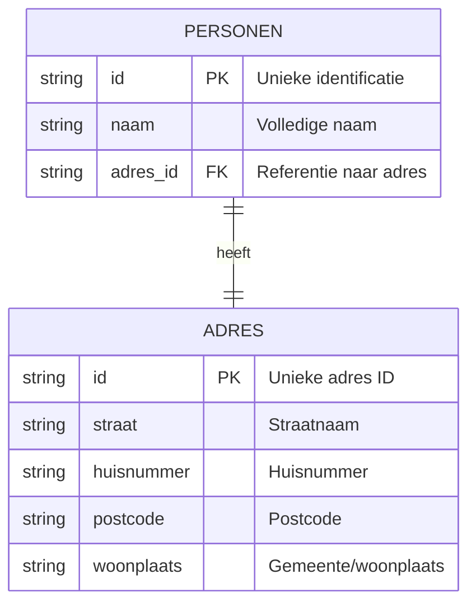

# Entity Relationship Diagram - Personen Datacontract

## ERD Diagram (Mermaid)



## Entity Details

### PERSONEN
| Veld | Type | Eigenschappen | Beschrijving |
|------|------|---------------|--------------|
| **id** | string | PK, Required | Unieke identificatie van de persoon |
| **naam** | string | Required | Volledige naam van de persoon |
| **adres_id** | string | FK, Required | Referentie naar ADRES entity |

### ADRES
| Veld | Type | Eigenschappen | Beschrijving |
|------|------|---------------|--------------|
| **id** | string | PK, Required | Unieke adres ID |
| **straat** | string | Required | Straatnaam |
| **huisnummer** | string | Required | Huisnummer |
| **postcode** | string | Required | Postcode |
| **woonplaats** | string | Required | Woonplaats of gemeente |

## Gegevenscontract Overzicht

- **Naam**: Personen
- **Versie**: 1.0.0
- **Owner**: Kadaster
- **Beschrijving**: Eenvoudig datacontract met persoonlijke gegevens
- **Beschikbare formaten**: JSON, CSV, Parquet

## SLA Vereisten
- **Beschikbaarheid**: 99.5% maandelijks
- **Verversing**: max 24 uur
- **Responstijd (p99)**: 500ms

## Voorbeeld Records

### PERSONEN
```json
{
  "id": "123456",
  "naam": "Jan Jansen",
  "adres_id": "ADDR001"
}
```

```json
{
  "id": "123457",
  "naam": "Maria Pieterse",
  "adres_id": "ADDR002"
}
```

### ADRES
```json
{
  "id": "ADDR001",
  "straat": "Koppejan",
  "huisnummer": "1",
  "postcode": "7461 DB",
  "woonplaats": "Rijssen"
}
```

```json
{
  "id": "ADDR002",
  "straat": "Kerkweg",
  "huisnummer": "42",
  "postcode": "7411 CX",
  "woonplaats": "Deventer"
}
```

---

**Gegenereerd op basis van**: `datacontract/personen.yaml`


